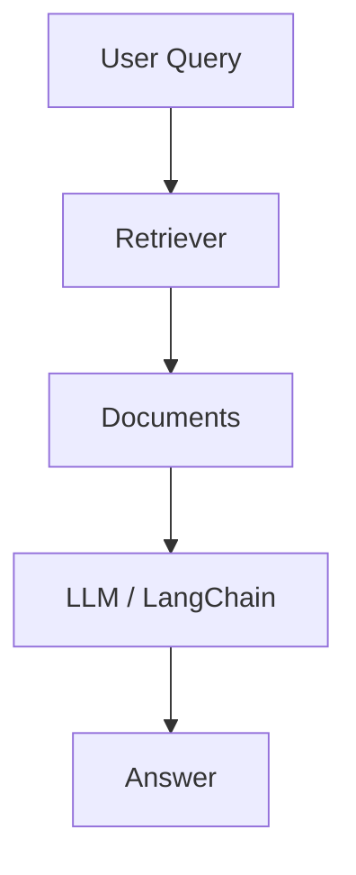
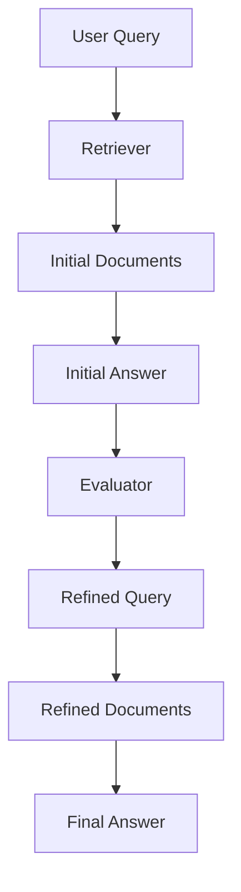
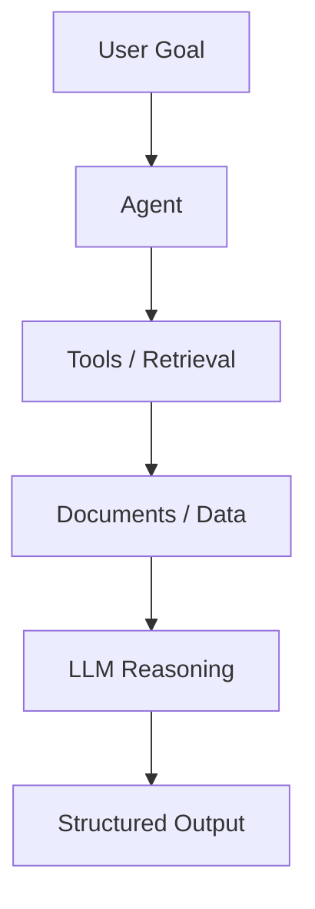
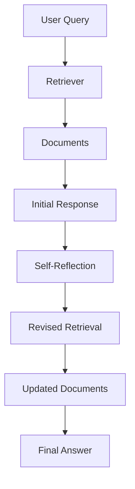

# 🔍 Master-RAG

A comprehensive collection of **Retrieval-Augmented Generation (RAG)** implementations using LangChain, exploring advanced techniques for improving retrieval and generation quality.

## 📁 Project Structure

### 🚀 Core Implementation

- **`rag_using_langchain.ipynb`** - Foundation RAG implementation with LangChain

### 📚 CRAG (Corrective RAG)

Progressive tutorial series on retrieval refinement and quality assessment:
- **1_basic_rag.ipynb** - Core RAG fundamentals
- **2_retrieval_refinement.ipynb** - Enhancing retrieval quality
- **3_retrieval_evaluator.ipynb** - Evaluating retrieval results
- **4_web_search_refinement.ipynb** - Integrating web search capabilities
- **5_query_rewrite.ipynb** - Query optimization techniques
- **6_ambiguous.ipynb** - Handling ambiguous queries

### 🤖 Agentic-RAG

A new folder containing agentic RAG examples and tooling for task-oriented agents using retrieval:
- **agentic-rag/1-build-tools.py** - Tool construction for agents
- **agentic-rag/2-import-tools.py** - Tool import and orchestration patterns
- **agentic-rag/3-basic-agent.py** - Simple agent-driven retrieval workflow
- **agentic-rag/4-streaming-steps.py** - Streaming agent step execution
- **agentic-rag/5-structured-output.py** - Structured output generation from agents
- **agentic-rag/6-production.py** - Production-ready agentic RAG patterns

### 🧠 Self-RAG

Self-reflective RAG with adaptive retrieval and generation:
- **self_rag_step1.ipynb** through **self_rag_step7.ipynb** - Progressive implementation
- **self_rag_web.ipynb** - Web-enabled variant

## 🛠️ Setup

This project uses Python with a virtual environment (`env/`). To get started:

```bash
# Activate the virtual environment
env\Scripts\activate
```

## 📦 Key Dependencies
- **LangChain** - Framework for building RAG applications
- **FAISS** - Efficient similarity search and vector retrieval
- **IPython** - Interactive notebooks
- **OpenAI/Anthropic APIs** - LLM integrations

## 🎯 What You'll Learn

- Building production-ready RAG systems
- Implementing retrieval optimization strategies
- Using self-reflection for quality improvement
- Integrating external knowledge sources
- Evaluating and improving generation quality
